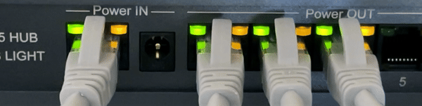
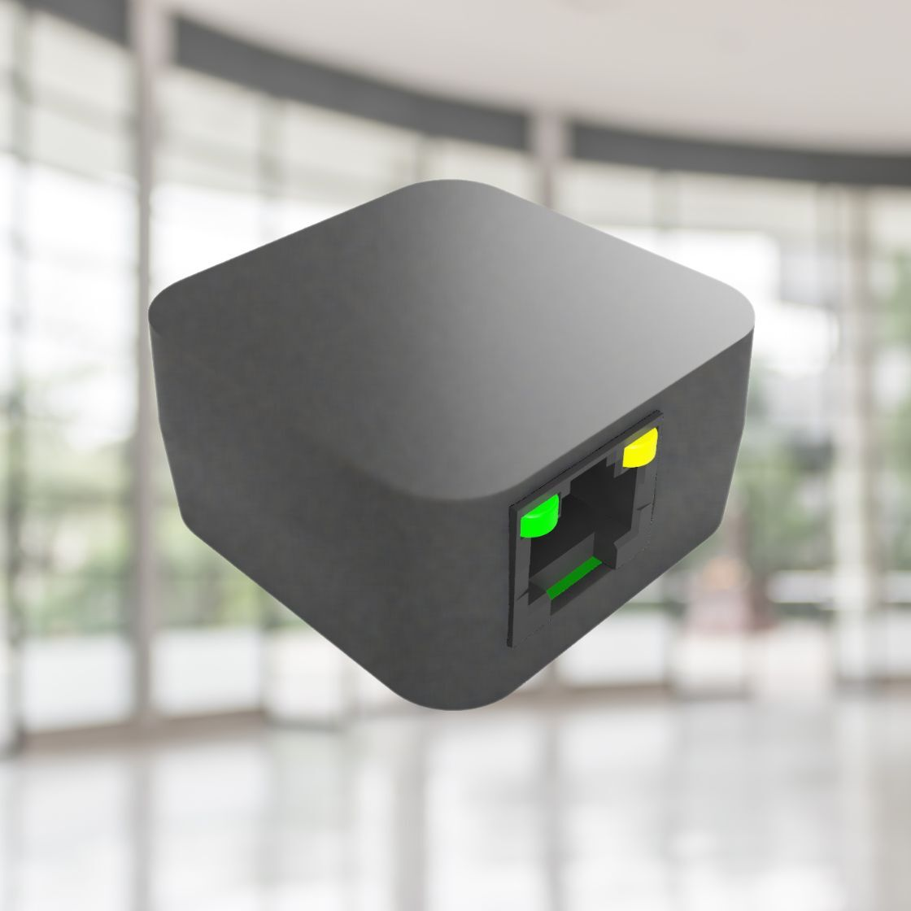
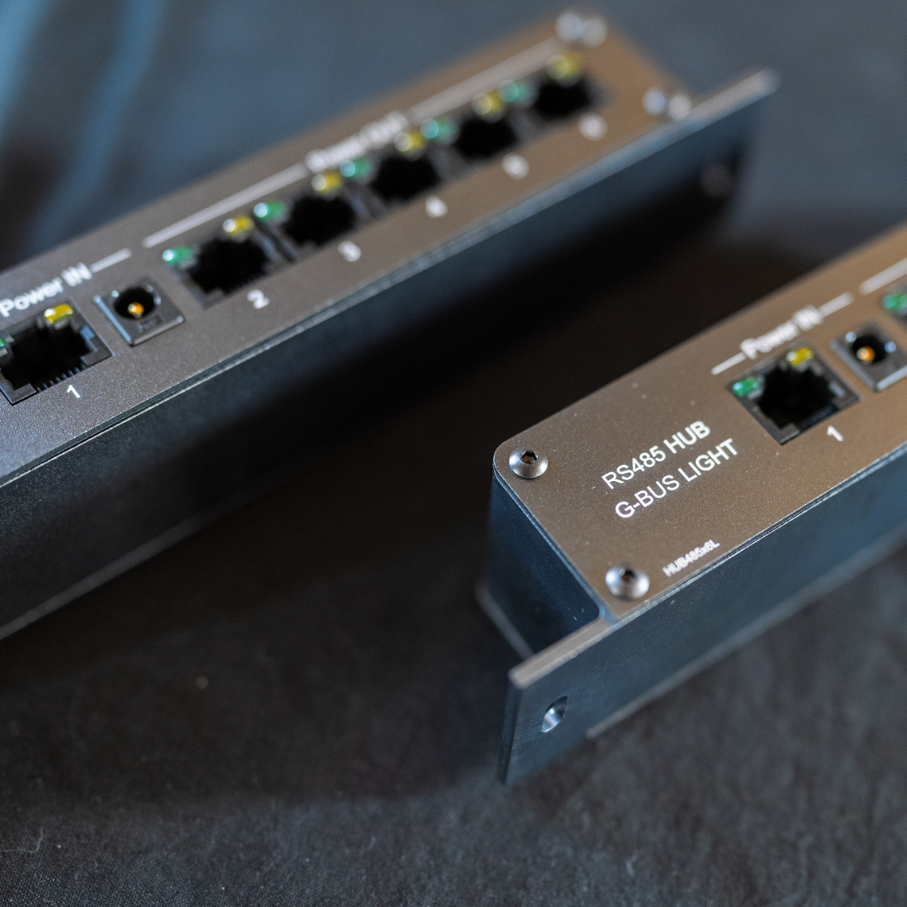

G-Bus : Le PoE pour RS485
=========================

## Véhiculez l'alimentation et les données de vos bus industriels dans un seul câble RJ45
### G-Bus est une spécification de mise en oeuvre ouverte, permettant de normaliser les bonnes pratiques et faciliter la compatibilité entre produits

#### [Échanger avec un expert ](https://coda.io/form/G-Bus_dW-qvQxBeKl?Origin=EXPERT)

  

**Mise en oeuvre normalisée**
-----------------------------

Le déploiement n'utilise que des prises RJ45 standard, existantes ou non, mais toujours réutilisables.
La spécification se concentre sur chaque liaison point à point et repose sur des périphériques pour constituer le bus à proprement parler (voir ci-dessous).

Les paires de la RJ45 sont affectées de manière standardisée afin de permettre la fourniture de :

*  **Une alimentation électrique pour l'électronique**
12V pour alimenter le fonctionnement du périphérique

*  **Une alimentation de puissance**
12-48V pour alimenter un accessoire de puissance

*  **Un bus de communication RS485**
100% conforme EIA-485

  

**Avantages**
-------------

*  ⚡️ Mise en oeuvre rapide, modulaire et robuste grâce à la prise RJ45
  
*  ⛑️ La standardisation permet un déploiement sécurisé au niveau électrique
  
*  📑 Documentation unique et pérenne pour l'ensemble des périphériques
  
*  👷🏻 Sous-traitance et réutilisation simplifiées car la qualité de la liaison est certifiable
  
*  🔎 Possibilités d'observabilité et d'audit étendues
  

  

**Des produits basés sur G-bus** 
---------------------------------

| **Splitter RS485** ||
| :------------ | ------------ |
| Un Splitter G-bus permet de convertir n'importe quel périphérique RS485 alimenté en 12V en périphérique G-bus.  [**Je veux l’essayer !**](https://coda.io/form/G-Bus_dW-qvQxBeKl?Origin=SPLIT)  |   |
| **Hub RS485** ||
|  | Un Hub G-bus permet de connecter un ensemble de liaisons G-bus indépendantes pour former un bus. *  Câblage en étoile tout en respectant strictement la norme EIA-485 *  Isolation de fonctionnement électrique et logique *  Facilité de diagnostic grâce aux leds par liaison  [**Je veux l’essayer !**](https://coda.io/form/G-Bus_dW-qvQxBeKl?Origin=HUB) |

  

**Questions - Réponses** 
---------------------------------
### **Je fais déjà du RS485 sur un câble RJ45, à quoi sert G-Bus ?**
G-Bus est une spécification dont le but est de permettre la meilleure interopérabilité possible. Il est tout à fait possible de faire du RS485 sans utiliser G-Bus mais cela requiert de penser son installation, faire des calculs de compatibilité à chaque fois et de documenter l’ensemble. A contrario, *G-Bus est une norme permettant à chacun de câbler de manière identique, compatible et sans risque pour le matériel avec des prérequis clairs permettant d’assurer le bon fonctionnement du premier coup.*

### **Quelle est la différence entre le G-Bus et l’OSDP ?**
Le G-Bus est une spécification ouverte pour la mise en œuvre d’un bus de communication RS485 à l’échelle industrielle.
OSDP est un protocole de communication utilisé pour permettre à des appareils de communiquer entre eux, via une liaison RS485.
G-Bus est donc tout à fait adapté pour connecter des périphériques OSDP, tout en apportant ses avantages dans la mise en œuvre.

### **Pourquoi G-bus "Light" ? Y a-t-il un G-bus "non-light" ?**
Tous les périphériques ne nécessitent pas de puissance, or cela influe beaucoup sur le prix de la solution mise en oeuvre. L'alimentation de puissance est donc optionnelle en G-Bus. On parle de G-Bus Power et G-Bus Light selon respectivement que le bus transporte une alimentation de puissance ou non.
Lorsque ce n’est pas précisé, on *ne peut pas* présupposer qu’une alimentation de puissance sera présente et donc on considère que c’est à minima un G-Bus Light.

  

**Qui nous sommes ?** 
---------------------------------
Le projet G-Bus est le fruit de la réflexion et de la recherche d’experts français en contrôle d'accès physique. Les ingénieurs de Gward et Welcomr ont travaillé main dans la main avec de nombreux intégrateurs de sûreté pour rendre les déploiements de sécurité électronique plus efficaces et mieux sécurisés tout en normalisant la mise en œuvre.

👉 *Vous avez des questions ? Des suggestions ?*

#### [**Contactez-nous !**](https://coda.io/form/G-Bus_dW-qvQxBeKl?Origin=CONTACT)

