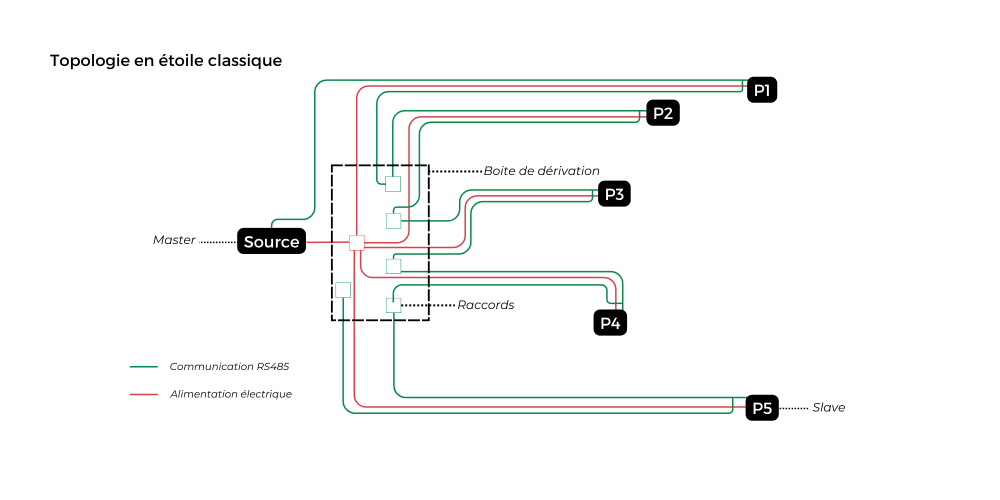
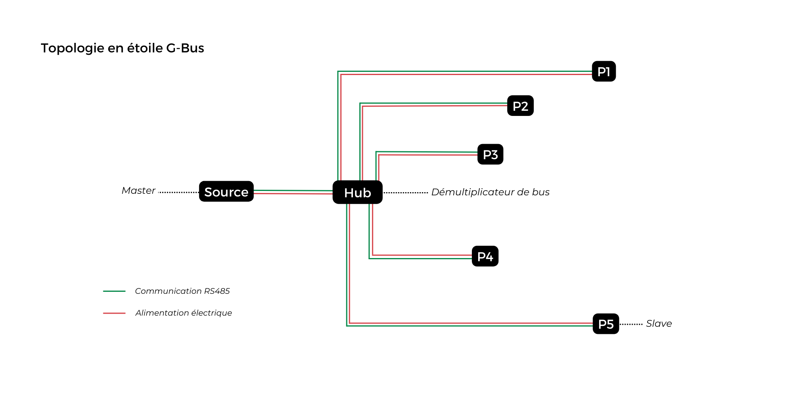
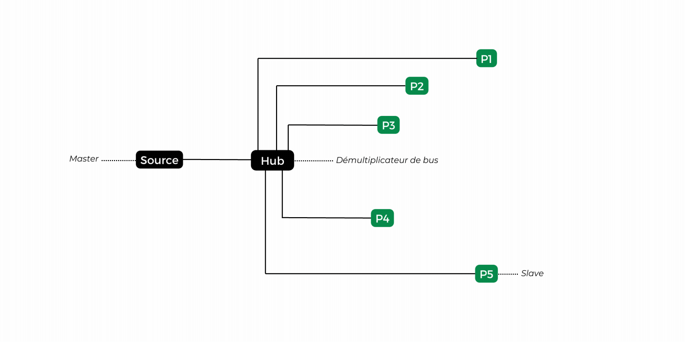

# Pourquoi adopter les specs G-Bus ?

## Un câble unique et une gestion centralisée pour des installations optimisées
G-Bus révolutionne le câblage des bus terrain en intégrant tout ce dont vous avez besoin dans un seul câble RJ45 standard : données (RS485) et alimentations (Logic Power et Work Power). Cela enlève la contrainte de mise en place des câbles dédiés RS485 en offrant l’opportunité de s'appuyer sur le réseau RJ45 déjà en place. Cela réduit non seulement la complexité de l'installation, mais aussi les coûts associés.

Grâce à la pratique familière du brassage comparable à celle utilisée dans les réseaux IP, les techniciens peuvent aisément ajuster les connexions depuis la baie de brassage, simplifiant ainsi les opérations d'installation et de modification du système.

## Topologie en étoile pour des installations évolutives et faciles à gérer
Contrairement à une topologie en étoile classique, où les périphériques sont branchés les uns après les autres sur la même ligne, la topologie en étoile G-Bus permet de créer un bus qui se démultiplie. Chaque branche de l’étoile est ainsi isolée. Cette configuration rend G-Bus idéal pour des installations évolutives et modulaires, tout en garantissant une performance et une fiabilité sans compromis.

## Interopérabilité avec tous types de périphériques compatibles RS485
G-Bus s’associe avec tous types de périphériques compatibles RS485 fonctionnant dans une plage de tension de 9 à 60 VDC. Tant que les périphériques peuvent supporter jusqu'à 60V sans subir de dommages, ils peuvent être intégrés sans problème. 

Par exemple, il est possible d’utiliser les spécifications G-bus aussi bien pour des périphériques de contrôle d’accès à 12V que pour des dispositifs de sécurité incendie à 24V, offrant ainsi une grande flexibilité et simplifiant l'installation et la maintenance des systèmes de sécurité et d'automatisation.

## Centralisation des alimentations 
La centralisation des alimentations offre plusieurs avantages significatifs. Elle permet la mise en place d'une alimentation secourue, garantissant la continuité de fonctionnement en cas de panne électrique. De plus, cette centralisation facilite l'asservissement des équipements, permettant une gestion coordonnée et efficace des dispositifs connectés. Enfin, elle améliore la supervision en offrant une vue globale et centralisée de l'état des alimentations et des communications de données, ce qui simplifie la maintenance et la détection des anomalies, assurant ainsi une meilleure fiabilité et sécurité du système.

## Sécurité renforcée pour un fonctionnement sûr et fiable en toutes circonstances
La sécurité est au cœur de la conception de G-Bus. Contrairement aux bus en série traditionnels, chaque branche est isolée, garantissant une isolation efficace des pannes. Une défaillance ou une tentative de malveillance sur une branche ou un périphérique n'affectera donc pas le reste du système.

## Standardisation et conformité du câblage
G-Bus garantit une installation 100% conforme aux normes EIA-485. Le câblage est standardisé, et les connecteurs RJ45 assurent la qualité des contacts et la cohérence du montage, ce qui est facilement vérifiable avec des outils comme ceux de type FLUKE. Chaque branche de l’étoile est équipée de résistances d’adaptation par défaut, assurant une performance optimale et une conformité totale aux meilleures pratiques RS485. Chaque branche est protégée (court-circuits, surconsommation, tensions inverses…).

## Optimisation du diagnostic et de la maintenance
Les LEDs intégrées aux périphériques fournissent des indications claires sur l'alimentation et la communication, permettant aux techniciens de détecter rapidement les éventuelles défaillances. Cela facilite l'identification de la source du problème et permet une intervention ciblée, réduisant ainsi les temps d'arrêt et les coûts de maintenance.

## Écologique et durable
G-Bus est conçu pour être une solution durable et respectueuse de l'environnement. En utilisant un seul câble pour la communication et l’alimentation et en facilitant l'interopérabilité, cette spécification optimise l'utilisation des ressources. Vous pouvez vous appuyer sur le réseau de câble RJ45 déjà en place sans devoir systématiquement doubler les lignes et réduire ainsi l'empreinte carbone de vos installations. C'est une solution pensée pour l'avenir, capable de s'adapter et de croître avec vos besoins.
